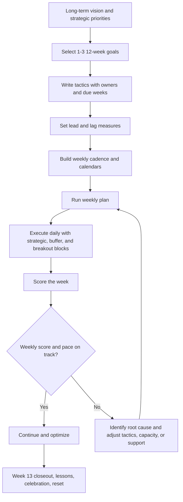
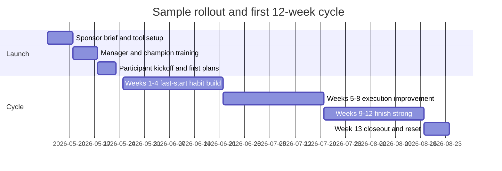

# Standard Operating Procedure for Implementing the 12 Week Year

## Executive summary

**/tldr** The 12 Week Year is best treated as an execution operating system, not a motivational slogan. A sound implementation keeps the book’s core logic intact—vision, a short planning horizon, written weekly plans, scorekeeping, protected strategic time, peer accountability, and a Week 13 reset—while adding modern change management, stronger measurement design, and fit-for-purpose software. The strongest outside evidence supports the same core moves the book emphasizes: specific and challenging goals outperform vague “do your best” goals; public and physically recorded progress monitoring improves goal attainment; and “if-then” planning increases follow-through when normal motivation dips. The biggest failure modes are predictable: too many goals, too many tactics, punitive accountability meetings, tool overengineering, and trying to compress annual-plan volume into a 12-week cycle without cutting work in progress. citeturn17view0turn17view1turn17view3turn12search0turn18view1

This SOP uses the attached *12 Week Year* PDF as the primary operating doctrine. The book’s execution model is built around eight elements—vision, planning, process control, measurement, time use, accountability, commitment, and greatness in the moment—organized into three principles and five disciplines. It further specifies the weekly routine of scoring the prior week, planning the next week, and participating in a Weekly Accountability Meeting; recommends a weekly execution score of at least 85 percent; and uses strategic, buffer, and breakout time blocks to protect execution quality. It also treats Week 13 as both a closeout buffer and a reset period for learning and replanning. These are the non-negotiable design anchors of the SOP below. (Attached PDF, book pp. 67–75, 107–125, 133–146, 177–179.) fileciteturn0file0

Analytically, the book is strongest on cadence and behavioral discipline. Its main blind spot for organizational deployment is that it assumes a motivated individual or team will simply install the routine. In practice, larger rollouts need sponsorship, role clarity, change communication, training, and reinforcement. That gap is where ADKAR and Kotter improve implementation: ADKAR centers individual adoption through awareness, desire, knowledge, ability, and reinforcement, while Kotter emphasizes urgency, coalition-building, barrier removal, short-term wins, and institutionalization. The SOP therefore preserves the book’s weekly operating rhythm but layers formal change management around it. citeturn9view4turn14view0turn14view2turn14view3

## SOP charter and design principles

### Purpose

The purpose of this SOP is to establish a repeatable, auditable method for implementing the 12 Week Year as an execution system for individuals, teams, or entire organizations. It standardizes how to translate a longer-term vision into a 12-week goal set, how to convert those goals into weekly executable tactics, how to review progress, and how to reset at the end of each cycle. The book argues that execution improves when a compelling vision, an action-based plan, process control, measurement, and deliberate time use work as an integrated system rather than as isolated practices. (Attached PDF, book pp. 67–75, 91–105.) fileciteturn0file0

### Scope

This SOP is adaptable across three deployment contexts:

| Context | Typical size | Default implementation pattern |
|---|---:|---|
| Small team | 1–10 | One shared cadence, lightweight tool stack, combined sponsor/program-owner role |
| Mid-sized organization | 11–100 | Pilot by function, team leads run WAMs, shared dashboard and monthly sponsor review |
| Large organization | >100 | Phased rollout, central program office, champion network, role-based dashboards, formal change plan |

The guidance applies whether the work is operational, commercial, educational, project-based, or administrative. Because the user did not specify industry or team structure, the templates and KPI thresholds below are role-agnostic defaults designed to be customized locally.

### Core policy statements

This SOP rests on six policy rules.

First, every 12-week cycle must be linked to a longer-term vision or strategic direction. The book is explicit that goals and plans should align with the longer-term vision; otherwise the cycle becomes activity without strategic meaning. (Attached PDF, book pp. 77–81, 103–104.) fileciteturn0file0

Second, each person or team should carry only the critical few goals. The book repeatedly argues that fewer goals and fewer tactics improve execution, and goal-setting research shows that performance rises when goals are specific, challenging, and supported by commitment and feedback. (Attached PDF, book pp. 92–105, 103–104.) fileciteturn0file0 citeturn17view0turn17view2turn17view3

Third, every tactic must be written, owned, dated, and executable in the week it is due. The book’s planning criteria require specificity, measurability, stretch, accountability, and time-boundedness. Locke and Latham likewise found that specific, difficult goals consistently outperform vague exhortations. (Attached PDF, book pp. 95–96, 99.) fileciteturn0file0 citeturn17view0

Fourth, execution must be judged weekly, not just by end-of-cycle results. The book’s weekly scorecard focuses on whether planned tactics were executed, and meta-analytic evidence shows that progress monitoring improves goal attainment, especially when progress is reported publicly and physically recorded. (Attached PDF, book pp. 117–125.) fileciteturn0file0 citeturn12search0turn12search9

Fifth, daily execution should be pre-decided as much as possible. The book’s model work week and time-blocking system reduce reactive work. Gollwitzer and Sheeran’s meta-analysis adds a practical enhancement: attach “if-then” rules to predictable disruptions so that missed defaults do not become missed weeks. citeturn18view1turn9view10

Sixth, accountability meetings must be developmental, not punitive. The book describes WAMs as short, focused meetings used to confront breakdowns, recognize progress, create focus, and encourage action—not to shame people. That distinction matters because commitment and public reporting are productive only when they strengthen ownership rather than trigger avoidance. (Attached PDF, book pp. 109–113.) fileciteturn0file0 citeturn17view3turn12search0

### Definitions

| Term | Working definition |
|---|---|
| 12 Week Year | A 12-week execution cycle used as the primary operating rhythm for achieving near-term goals linked to longer-term vision |
| Vision | Longer-term picture of the future that gives emotional meaning and direction to current goals |
| 12-week goal | A specific, measurable result to be achieved by the end of the cycle |
| Tactic | A concrete action, written as a verb-led sentence, that advances a 12-week goal |
| Weekly plan | The subset of tactics due this week, used to manage daily execution |
| Weekly execution score | `Completed tactics due this week / total tactics due this week` |
| Lead measure | Input or behavioral measure that drives the lag result |
| Lag measure | Outcome measure that shows whether the goal was achieved |
| WAM | Weekly Accountability Meeting; a 15–30 minute peer or team review focused on results-to-date, weekly score, intentions, and support |
| Strategic block | Protected high-value work block, typically three hours |
| Buffer block | Short block for email, calls, quick approvals, and low-level admin |
| Breakout block | Restorative block used to prevent burnout after the cadence is established |
| Week 13 | Buffer, retrospective, celebration, and reset week before the next cycle |

These definitions are drawn from the attached PDF and lightly operationalized for SOP use. (Attached PDF, book pp. 67–75, 107–125, 133–146, 177–179.) fileciteturn0file0

## Roles and governance

A 12 Week Year rollout fails when ownership is blurry. The book explicitly warns that “everyone’s challenge is no one’s challenge” and says leaders must model the behavior they want to see. That is consistent with change-management research emphasizing visible sponsorship, coalition-building, and reinforcement. (Attached PDF, book pp. 95–96, 111–115.) fileciteturn0file0 citeturn9view4turn14view0turn14view3

| Role | Core responsibilities | Small team | Mid-sized | Large |
|---|---|---|---|---|
| Executive sponsor | Sets case for change, protects scope, reviews progress every 4 weeks, removes systemic barriers | Owner or founder | Department head | Senior sponsor or steering committee lead |
| Program owner | Owns SOP, templates, KPI definitions, cycle calendar, reporting standards | Same person as sponsor | Ops/PMO lead | Central transformation or PMO lead |
| Team lead | Reviews plans for quality, coaches tactics, facilitates escalations, ensures WAMs occur | Same as sponsor or peer lead | Manager/supervisor | Function or business-unit leader |
| WAM facilitator | Runs meeting, protects tone and timebox, captures actions | Rotating peer | Team lead or peer champion | Trained facilitator or manager |
| Participant | Owns goals, tactics, score, calendar blocks, and reporting | Every member | Every member | Every member |
| Systems/data admin | Maintains tool setup, scorecards, permissions, dashboards | Optional | Part-time admin | Dedicated analyst/admin |
| Change champion | Reinforces adoption, troubleshoots local resistance, shares wins | Not required | 1 per team or function | Formal network by department |

### Governance cadence

| Meeting | Cadence | Duration | Audience | Decision focus |
|---|---|---:|---|---|
| Cycle kickoff | Once per 12-week cycle | 60–120 min | Team or unit | Approve goals, owners, tactics, tool setup |
| WAM | Weekly | 15–30 min | 2–8 participants | Execution score, blockers, commitments |
| Four-week operating review | Every 4 weeks | 30–60 min | Sponsor + leads | Goal pace, barrier removal, training needs |
| Week 13 closeout | End of cycle | 60–90 min | Team + sponsor | Results, lessons, carry-forward, recognition |
| Tool/admin review | Monthly | 30 min | Program owner + admin | Data quality, template changes, permissions |

A practical rule is that sponsors should review barriers and outcomes every four weeks, but not micromanage every WAM. The book’s cadence is weekly execution; Kotter’s logic suggests sponsors add urgency and remove barriers, while ADKAR suggests managers and local leaders are more important than central messaging for day-to-day adoption. citeturn9view4turn14view0turn14view2

## Standard operating procedure



### Pre-launch preparation

Before the first cycle begins, the sponsor and program owner must define the deployment boundary, decide whether the rollout is individual, team-based, or organizational, and choose a minimum viable tool stack. They must also publish the cycle calendar: kickoff date, 12 execution weeks, all WAM times, four-week reviews, and Week 13. This is where many implementations quietly fail: they announce a method before they build a calendar, owners, or reporting rules. The book’s closed-system logic is useful here—if planning, process control, measurement, and time use are missing at launch, the operating system is incomplete from day one. (Attached PDF, book pp. 74–75, 105–113.) fileciteturn0file0

Required outputs from pre-launch are a sponsor memo, role assignments, cycle calendar, template package, and tool workspace. For mid-sized and large rollouts, add a pilot scope, a champion list, and a training roster. This augmentation is an inference from applying the book’s operating doctrine through ADKAR and Kotter, not a direct claim made in the book. citeturn9view4turn14view0turn14view3

### Goal and plan creation

Each participant or team should create one to three 12-week goals. The book says many efforts are comprised of two or three goals and repeatedly warns against too much focus fragmentation. Each goal must be specific, measurable, positively stated, realistically stretching, owned, and time-bound, and each tactic should begin with a verb and be executable in the week it is due. Locke and Latham’s work strengthens this design choice: specific, difficult goals direct attention, increase effort and persistence, and improve performance more reliably than vague intentions. (Attached PDF, book pp. 92–105.) fileciteturn0file0 citeturn17view0turn17view1turn17view3

A rigorous SOP should also add one enhancement the book implies but does not formalize: each major tactic should include an “if-then” contingency. Example: “If my Tuesday strategic block is interrupted, then I will move it to the next available three-hour block within 48 hours.” Implementation-intention research found that plans specifying the when, where, and how of action showed a medium-to-large positive effect on goal attainment. citeturn18view1

### Weekly operating rhythm

The weekly routine is the heart of the SOP. The book defines it in three steps: score the prior week, plan the current week, and participate in a WAM. It also recommends that the score-plan step take about 15 minutes and notes that WAMs are typically held on Monday morning and last about 15 to 30 minutes. (Attached PDF, book pp. 109–113.) fileciteturn0file0

The standard weekly procedure is:

1. **Score the prior week.** Count the tactics due last week, count those completed, calculate the execution percentage, and update lead and lag metrics.
2. **Plan the new week.** Pull forward only the tactics due this week, schedule them into the calendar, and explicitly reassign any carryovers.
3. **Run the WAM.** Each member reports results-to-date, weekly execution score, intentions for the new week, and asks for support.
4. **Escalate barriers.** Any structural blocker that cannot be resolved by the participant or team lead within one week goes to the sponsor review queue.

The book’s recommended benchmark is an average weekly execution score of at least 85 percent; it also suggests that a weekly score below 60 percent is a sign that intervention may be needed. Progress-monitoring evidence reinforces this structure, especially the public and recorded nature of weekly scoring. (Attached PDF, book pp. 120–125.) fileciteturn0file0 citeturn12search0turn12search9

### Daily execution and calendar control

The daily SOP is simple: do not manage the week from memory. The book argues that printed or written weekly plans become the document used to manage each day and recommends a model work week that includes one three-hour strategic block, one to two buffer blocks per day, and a breakout block once the system is stable. It also recommends scheduling the 15-minute Monday review, and placing strategic blocks early in the week so they can be rescheduled if lost. (Attached PDF, book pp. 107, 133–146.) fileciteturn0file0

A modern implementation should pair this with calendar features that actively defend focus time. Google Calendar’s focus-time events can mute chat notifications, automatically decline meetings, and repeat on a schedule. For teams that rely on chat, Slack reminders can reinforce planning deadlines, WAM attendance, and tactic due dates. These features are not substitutes for the weekly plan, but they reduce the friction of protecting it. citeturn9view10turn9view11

### Review, intervention, and Week 13 closeout

A four-week checkpoint should examine three things: goal pace, execution quality, and adoption quality. Goal pace asks whether lag and lead measures are on plan. Execution quality asks whether average weekly scores are trending toward or above 85 percent. Adoption quality asks whether participants are actually using the system: weekly plan completion, WAM attendance, and strategic block completion. This layered review is consistent with the book’s idea that the system is self-correcting and with self-regulation research emphasizing monitoring and feedback loops. (Attached PDF, book pp. 74–75, 117–125, 177–179.) fileciteturn0file0 citeturn12search0turn19search1

Week 13 serves four purposes. It is a buffer week for any critical last actions, a retrospective on what worked and what failed, a recognition moment for short-term wins, and the planning bridge to the next cycle. The book explicitly describes Week 13 as an opportunity to assess performance, decide what to change, and celebrate progress and success. Kotter’s emphasis on generating and communicating short-term wins makes this closeout step strategically important rather than ceremonial. (Attached PDF, book pp. 179–179.) fileciteturn0file0 citeturn14view2turn14view3

## Templates and sample artifacts

### Template comparison

| Template | Primary purpose | Owner | Update cadence | Minimum required fields |
|---|---|---|---|---|
| Goal plan | Define results and tactics for the cycle | Individual or team lead | Once per cycle, then revise only if formally re-baselined | Goal, target, lead/lag measures, tactics, owners, week due |
| Weekly plan | Convert cycle plan into this week’s executable list | Individual | Weekly | Goal link, tactic, due day, calendar slot, if-then backup |
| Daily plan | Control today’s execution | Individual | Daily | Top 3 priorities, time blocks, admin items, follow-ups |
| WAM agenda | Standardize accountability meeting | Facilitator | Weekly | Results-to-date, score, intentions, blockers, commitments |
| Scorecard | Quantify execution and pace | Individual and team lead | Weekly | Tactics due, tactics completed, execution %, lead/lag results |
| Four-week review | Escalate barriers and rebalance support | Sponsor and leads | Every 4 weeks | Goal pace, execution trend, adoption data, decisions |
| Week 13 review | Learn, recognize, and reset | Team lead | End of cycle | target vs actual, lessons, carry-forward, new risks |

The overall structure is derived from the book’s plan, weekly plan, scorecard, WAM, and time-blocking logic, with the “if-then” field added from implementation-intention research. (Attached PDF, book pp. 95–99, 107–125, 133–146.) fileciteturn0file0 citeturn18view1

### Goal plan template

**Blank**

| Goal statement | Baseline | Target by Week 12 | Lead measures | Lag measure | Owner |
|---|---:|---:|---|---|---|
|  |  |  |  |  |  |

| Tactic | Week due | Exact owner | Success condition | If-then contingency |
|---|---:|---|---|---|
|  |  |  |  |  |
|  |  |  |  |  |
|  |  |  |  |  |

**Sample filled**

| Goal statement | Baseline | Target by Week 12 | Lead measures | Lag measure | Owner |
|---|---:|---:|---|---|---|
| Improve on-time project delivery | 72% | 90% | weekly blocked-item resolution rate; weekly plan completion; strategic block completion | on-time delivery % | Operations lead |

| Tactic | Week due | Exact owner | Success condition | If-then contingency |
|---|---:|---|---|---|
| Publish project status template | 2 | Ops lead | Template live and in use | If delayed, use draft version in Week 2 WAM |
| Cap active priorities at top 3 per owner | 1 | Team leads | WIP limits published | If a fourth priority is added, one existing item must be deferred |
| Review aged blockers every Thursday | 1–12 | All leads | Blocker list updated weekly | If review is missed, complete by Friday noon |
| Protect Tuesday strategic block | 1–12 | Every owner | 3-hour block on calendar | If interrupted, move within 48 hours |

### Weekly plan template

**Blank**

| Goal | Tactic due this week | Day | Calendar slot | Priority | If-then backup | Done |
|---|---|---|---|---|---|---|
|  |  |  |  | H/M/L |  | ☐ |
|  |  |  |  | H/M/L |  | ☐ |
|  |  |  |  | H/M/L |  | ☐ |

**Sample filled**

| Goal | Tactic due this week | Day | Calendar slot | Priority | If-then backup | Done |
|---|---|---|---|---|---|---|
| Improve on-time delivery | Thursday blocker review | Thu | 2:00–2:45 pm | H | If sponsor meeting overruns, move to Thu 4:30 pm | ☐ |
| Improve on-time delivery | Strategic block on overdue work packages | Tue | 8:00–11:00 am | H | If lost, reschedule Wed 8:00–11:00 am | ☐ |
| Improve on-time delivery | Publish team status update | Fri | 3:00–3:30 pm | M | If not ready, use standard fallback template | ☐ |

### Daily plan template

**Blank**

| Today’s top 3 | Start time | End time | Notes |
|---|---:|---:|---|
|  |  |  |  |
|  |  |  |  |
|  |  |  |  |

| Buffer/admin items | Time block |
|---|---|
|  |  |

**Sample filled**

| Today’s top 3 | Start time | End time | Notes |
|---|---:|---:|---|
| Clear two aged blockers | 8:00 am | 9:30 am | Strategic block |
| Draft weekly update | 9:45 am | 10:15 am | Use standard template |
| Confirm next week’s due tactics | 4:15 pm | 4:30 pm | Pre-plan tomorrow |

| Buffer/admin items | Time block |
|---|---|
| Email, quick approvals, Slack follow-ups | 11:30 am–12:00 pm and 4:30 pm–5:00 pm |

### Accountability meeting agenda template

**Blank**

| Agenda item | Time | Owner | Output |
|---|---:|---|---|
| Results to date | 2 min each | Participant | Pace status |
| Weekly execution score | 1 min each | Participant | Score reported |
| Commitments for current week | 1 min each | Participant | Top focus declared |
| Blockers and asks | 1 min each | Participant | Help requests logged |
| Transferable wins | 5 min | Group | Practices shared |
| Close and encouragement | 2 min | Facilitator | Next commitments confirmed |

**Sample filled**

| Agenda item | Time | Owner | Output |
|---|---:|---|---|
| Results to date | 6 min | All 3 members | “78% on-time delivery; behind pace” |
| Weekly execution score | 3 min | All 3 members | “80%, 100%, 67%” |
| Commitments for current week | 3 min | All 3 members | Top 1–2 tactics per person |
| Blockers and asks | 5 min | All 3 members | Two escalations to sponsor |
| Transferable wins | 5 min | Group | Shared status-template shortcut |
| Close | 2 min | Facilitator | Confidence check, next WAM |

### Scorecard template

**Blank**

| Week | Tactics due | Tactics completed | Weekly execution score | Lead measure 1 | Lead measure 2 | Lag measure | Notes |
|---|---:|---:|---:|---|---|---|---|
| 1 |  |  |  |  |  |  |  |
| 2 |  |  |  |  |  |  |  |
| 3 |  |  |  |  |  |  |  |

**Sample filled**

| Week | Tactics due | Tactics completed | Weekly execution score | Lead measure 1 | Lead measure 2 | Lag measure | Notes |
|---|---:|---:|---:|---|---|---|---|
| 1 | 4 | 3 | 75% | 3/4 blocker reviews | 80% weekly plans on time | 74% on-time delivery | Missed one strategic block |
| 2 | 5 | 5 | 100% | 5/5 blocker reviews | 100% weekly plans on time | 77% on-time delivery | Good recovery |
| 3 | 5 | 4 | 80% | 4/5 blocker reviews | 100% weekly plans on time | 78% on-time delivery | One carryover |

## KPIs, reporting, and tools

### KPI framework

A strong 12 Week Year implementation needs three KPI layers: adoption, execution, and outcomes. The book distinguishes lead and lag measures and argues that execution scoring is often the strongest predictor of success. Outside evidence supports that view: progress monitoring improves goal attainment, and publicly reported or physically recorded progress enhances the effect. (Attached PDF, book pp. 117–125.) fileciteturn0file0 citeturn12search0turn12search9

| KPI | Formula | Cadence | Default threshold | Why it matters |
|---|---|---|---|---|
| Weekly execution score | completed tactics / tactics due | Weekly | Green `>=85%`; Amber `70–84%`; Red `<70%` | Core predictor in the book; below 60% merits intervention (book default) |
| Goal pace ratio | actual cumulative lag / planned cumulative lag | Weekly | Green `>=1.0`; Amber `.9–.99`; Red `<.9` | Avoids late surprise at Week 12 |
| Lead pace ratio | actual cumulative lead / planned cumulative lead | Weekly | Depends on metric | Detects whether behaviors are sufficient before lag misses appear |
| Weekly plan completion | people with weekly plan by deadline / total people | Weekly | `>=95%` | Measures real adoption of process control |
| WAM attendance | attendees / required attendees | Weekly | `>=90%` | Commitment and public reporting increase follow-through |
| Strategic block completion | completed blocks / planned blocks | Weekly | `>=80%` | Protects high-value work from reactive drift |
| Data freshness | scorecards updated on time / total scorecards | Weekly | `>=95%` | Monitoring only works if current |
| Recovery rate | red items with corrective action within 7 days / total red items | Weekly | `>=90%` | Tests whether the system self-corrects |

### Reporting formats

| Report | Audience | Cadence | Required contents |
|---|---|---|---|
| Individual scorecard | Participant + lead | Weekly | execution %, lead/lag update, next-week commitments |
| Team dashboard | Team + sponsor | Weekly | average execution %, goal pace, WAM attendance, blocked items |
| Four-week operating review | Sponsor + leads | Every 4 weeks | trend lines, green/amber/red goals, system barriers, decisions |
| Week 13 closeout memo | Sponsor + full team | End of cycle | target vs actual, average execution, lessons, wins, carry-forward plan |
| Portfolio summary | Executive audience | Monthly | cross-team goal health, adoption rates, barrier themes, resource actions |

### Software recommendations

| Tool stack | Best fit | Strengths for 12 Week Year | Main trade-off | Evidence |
|---|---|---|---|---|
| **Google Sheets + Google Calendar + Slack** | Small teams and low-cost pilots | Sheets supports checkboxes and dashboard-style charts; Calendar supports recurring focus time with meeting auto-decline; Slack supports personal and channel reminders | Manual governance; limited portfolio rollup | citeturn3search1turn3search14turn9view10turn9view11 |
| **Asana** | Mid-sized cross-functional teams | Goals connect work to outcomes; portfolios give cross-project status, dashboards, workload, and timelines; templates, recurring tasks, and rules reduce admin overhead | Best value appears when teams standardize structure | citeturn1search12turn11view2turn10search1turn10search2turn10search3turn10search8turn10search12 |
| **Microsoft Planner** | Microsoft 365 organizations | Unified work-management experience; recurring tasks; charts for late/urgent/overloaded work; premium timeline, dependencies, milestones, custom fields, and people view | Some advanced features require premium plans; Teams-heavy orgs may over-meeting themselves | citeturn9view7turn11view3turn15view0turn15view1 |
| **Notion** | Teams wanting flexible docs + tasks + dashboards in one workspace | Dashboard view combines tables, boards, timelines, calendars, and charts; timelines show project progress over time; repeating database templates can auto-create recurring tasks, meeting notes, and weekly updates | Requires design discipline or it becomes cluttered | citeturn9view8turn11view4turn20view0 |
| **ClickUp** | Mid-sized teams with frequent recurring operational work | Goals are measurable targets and can track weekly scorecards; recurring tasks are robust and customizable | Configuration can become complex if every team customizes differently | citeturn9view9turn11view5 |
| **Jira + Atlassian Goals** | Large teams, product/IT/ops environments | Goals connect projects and work items to outcomes; Jira dashboards and gadgets provide customizable reporting; Atlassian can distribute weekly project and monthly goal updates | Best for organizations already living in Atlassian | citeturn11view0turn16search0turn16search1turn16search5turn16search10turn16search16 |

For solo operators or very small teams, Todoist is also viable because recurring dates can be created quickly and future occurrences can be shown in calendar layout, but it is better as a personal execution layer than as an organizational reporting system. citeturn11view6

### Tool-selection defaults by size

For **small teams**, start with a minimum viable stack: spreadsheet scorecard, calendar blocking, and reminders. The real risk is not lacking enterprise features; it is overbuilding before habits exist.

For **mid-sized organizations**, the best balance is usually Asana, Planner, Notion, or ClickUp, depending on the existing software ecosystem. The priority should be repeatable templates, recurring tasks, dashboards, and straightforward ownership visibility. citeturn11view2turn11view3turn20view0turn9view9

For **large organizations**, the priority shifts from individual task convenience to portfolio visibility, permissions, standardization, and sponsor reporting. Planner premium or Jira/Atlassian stacks are stronger here, with Asana also viable where it is already established. citeturn15view1turn16search0turn16search10turn11view2

## Training, change management, and pitfalls

### Training and onboarding plan

The book says leaders must model the weekly routine themselves if they want teams to adopt it. ADKAR adds that people need awareness, desire, knowledge, ability, and reinforcement—not just exposure. The training plan below follows that logic. (Attached PDF, book pp. 113–115.) fileciteturn0file0 citeturn9view4

| Audience | Training objective | Suggested format | Timing |
|---|---|---|---|
| Sponsors | Understand the operating model, barrier-removal role, review cadence | 60-minute briefing | 2 weeks pre-launch |
| Managers/team leads | Learn plan review, coaching, WAM facilitation, KPI interpretation | 90-minute workshop | 1–2 weeks pre-launch |
| Participants | Build first 12-week goal, weekly plan, scorecard, and calendar blocks | 2-hour hands-on session | 1 week pre-launch |
| Admins/champions | Configure tools, dashboards, templates, permissions | 60–90 minutes | pre-launch |
| All users | Refresh and troubleshoot | office hours / Q&A | Weeks 2, 4, 8 |

A good onboarding sequence is: teach the model, build the first plan live, calendarize the weekly routine before anyone leaves training, then run the first WAM within seven days. That ordering matches behavior-change research showing that rapid action after initial exposure improves habit formation and follow-through. (Attached PDF, book pp. 177–178.) fileciteturn0file0 citeturn18view1turn19search0

### Change-management pattern by size

For small teams, direct sponsorship and visible modeling matter more than formal change assets. For mid-sized groups, use a pilot-first model and create one champion per team. For large organizations, use Kotter’s logic explicitly: create urgency around execution quality, form a cross-functional coalition, remove barriers, publish short-term wins, and reinforce new norms through dashboards, manager check-ins, and Week 13 reviews. ADKAR should be used to diagnose whether resistance is due to lack of awareness, lack of desire, lack of knowledge, lack of ability, or weak reinforcement. citeturn14view0turn14view2turn14view3turn9view4



### Common pitfalls and mitigation

| Pitfall | What it looks like | Root cause | Mitigation |
|---|---|---|---|
| Too many goals | Weekly plans overflow; constant spillover | Annual-plan volume kept intact | Limit to the critical few goals and tactics; apply WIP limits |
| Vague goals | “Improve communication” with no measure | Poor planning discipline | Rewrite using specific, measurable, stretch outcome language |
| Punitive WAMs | People hide misses or stop updating | Accountability confused with blame | Use the book’s supportive WAM agenda and timebox |
| Scoring only lag measures | Late surprises in Week 10–12 | No lead indicators or execution score | Track weekly execution plus 2–4 lead measures per goal |
| Strategic blocks collapse | Meetings consume every high-value slot | Calendar not defended | Schedule blocks early; use focus time and auto-decline rules |
| Tool sprawl | Multiple apps, duplicate updates, stale dashboards | Technology before process | Start with one system of record and one dashboard owner |
| Mid-cycle drop-off | Strong Week 1–2, weak Week 5–8 | Novelty wears off; weak reinforcement | Four-week review, recognition of wins, manager coaching |
| Carryover becomes normal | Same items move week to week | Overloaded tactics or weak ownership | Cut volume, tighten owner clarity, add if-then contingencies |

These mitigations are directly consistent with the book’s warnings about focus, simplicity, meaning, written planning, weekly scoring, and leadership modeling, while also reflecting evidence on goal commitment, monitoring, and implementation intentions. (Attached PDF, book pp. 103–125, 133–146, 177–179.) fileciteturn0file0 citeturn17view3turn12search0turn18view1

## Source URLs and limitations

**Primary source used as the foundation:** the attached uploaded PDF, *12 Week Year.pdf*.

**Public URLs referenced in the research above:**
```text
https://med.stanford.edu/content/dam/sm/s-spire/documents/PD.locke-and-latham-retrospective_Paper.pdf
https://www.sciencedirect.com/science/chapter/bookseries/pii/S0065260106380021
https://www.apa.org/pubs/journals/releases/bul-bul0000025.pdf
https://pmc.ncbi.nlm.nih.gov/articles/PMC7429262/
https://www.prosci.com/methodology/adkar
https://www.kotterinc.com/methodology/8-steps/
https://help.asana.com/s/article/get-started-with-asana-goals?language=en_US
https://asana.com/features/goals-reporting/portfolios
https://help.asana.com/s/article/reporting-with-dashboards?language=en_US
https://support.microsoft.com/en-us/office/recurring-tasks-in-planner-9f2561ee-45ee-4834-955b-c457f8bb0490
https://support.microsoft.com/en-us/office/view-charts-of-your-plan-s-progress-7fee6495-d9c3-489a-8ae4-345804d2035c
https://support.microsoft.com/en-us/office/advanced-capabilities-with-premium-plans-in-planner-6cdba2aa-da06-4e08-be4c-baaa4fda17ba
https://support.google.com/calendar/answer/11190973?co=GENIE.Platform%3DDesktop&hl=en
https://slack.com/help/articles/208423427-Set-a-reminder
https://www.notion.com/help/dashboards
https://www.notion.com/help/timelines
https://www.notion.com/help/guides/automate-work-repeating-database-templates
https://help.clickup.com/hc/en-us/articles/6325733579671-Create-a-Goal
https://help.clickup.com/hc/en-us/articles/6309885016471-Use-recurring-tasks
https://support.atlassian.com/jira-software-cloud/docs/create-and-edit-dashboards/
https://support.atlassian.com/platform-experiences/docs/what-is-a-goal/
https://support.atlassian.com/platform-experiences/docs/track-goals-and-projects-across-atlassian-products/
https://support.atlassian.com/platform-experiences/docs/follow-goals-projects-teams-and-topics/
https://www.todoist.com/help/articles/introduction-to-recurring-dates-YUYVJJAV
```

**Limitations.** Because no industry, team topology, or existing software environment was specified, the SOP uses adaptable defaults rather than sector-specific KPIs or compliance requirements. The attached PDF was used directly as the primary source; page references in the report refer to the book pagination visible in that uploaded file.